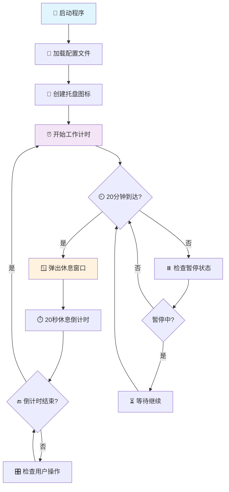

<div align="center">

# 👁️ 20-20-20 护眼提醒器 V2

### 🛡️ 专业护眼 · 健康办公 · 智能提醒

[](https://www.python.org/)
[](https://www.microsoft.com/windows)
[](https://opensource.org/licenses/MIT)
[](https://github.com/your-repo)

**遵循科学的"20-20-20 护眼法则"，每 20 分钟提醒您看向 20 英尺（约 6 米）外的物体 20 秒钟**

[快速开始](#-快速开始) • [功能特色](#-功能特色) • [使用说明](#-使用说明) • [配置选项](#-配置选项) • [故障排除](#-故障排除)

</div>

---

## 🌟 功能特色

<table>
<tr>
<td width="50%">

### 🔧 核心功能

- 🖥️ **静默后台运行** - 无干扰系统托盘模式
- ⏰ **精准计时提醒** - 20 分钟自动循环计时
- 🔝 **强制置顶窗口** - 确保提醒不被错过
- 📊 **可视化倒计时** - 进度条 + 数字双重显示
- 🎛️ **智能托盘控制** - 暂停、立即休息、退出

</td>
<td width="50%">

### ✨ 增强功能

- 🎨 **现代化界面** - 扁平化设计，视觉友好
- ⚙️ **高度可配置** - 时间、颜色、文本自定义
- 🧪 **测试模式** - 快速验证功能（秒级测试）
- 🔄 **灵活控制** - 跳过休息、延长时间
- 📝 **详细日志** - 调试模式输出运行状态

</td>
</tr>
</table>

## 📁 项目架构

```
📦 减少眼睛疲劳project/
├── 🚀 启动护眼提醒器.bat     # Windows一键启动脚本
├── 🐍 start.py              # 智能启动器（依赖检查+安装）
├── 💻 main.py               # 核心主程序（托盘+计时逻辑）
├── 🖼️ reminder_window.py     # 休息提醒窗口模块
├── ⚙️ config.py             # 配置文件（用户可自定义）
├── 🎨 create_icon.py        # 托盘图标生成器
├── 📦 requirements.txt      # Python依赖清单
├── 📖 README.md            # 项目详细说明
├── 📋 使用说明.md          # 用户操作指南
├── 📊 项目总结.md          # 开发完成报告
└── 🖼️ icon*.png            # 多尺寸托盘图标
```

## 🚀 快速开始

### 🎯 方法一：一键启动（推荐新手）

```batch
# 双击运行，全自动处理
启动护眼提醒器.bat
```

### 🎯 方法二：智能启动（推荐开发者）

```bash
# 自动检查依赖并启动
python start.py
```

### 🎯 方法三：手动安装（高级用户）

```bash
# 1. 安装Python依赖
pip install -r requirements.txt

# 2. 生成托盘图标
python create_icon.py

# 3. 启动主程序
python main.py
```

## 🎯 使用说明

### 🖱️ 系统托盘控制

<div align="center">

|      操作       |      功能说明      | 图标 |
| :-------------: | :----------------: | :--: |
|  **右键菜单**   |    显示控制选项    |  👆  |
| **⏸ 暂停/继续** | 暂停或恢复工作计时 |  ⏯️  |
| **⏱ 立即休息**  |  跳过当前工作时间  |  🏃‍♂️  |
|   **❌ 退出**   |  关闭程序移除图标  |  🚫  |

</div>

### 🪟 休息窗口交互

当工作计时到达 20 分钟时，将弹出休息提醒窗口：

<table>
<tr>
<td width="50%">

**📊 显示信息**

- ⏰ 20 秒倒计时数字
- 📈 可视化进度条
- 🎨 颜色渐变提醒
- 💡 护眼建议文本

</td>
<td width="50%">

**🎛️ 操作按钮**

- ⏭️ **跳过休息** - 立即关闭继续工作
- ⏰ **延长休息** - 增加 10 秒休息时间
- 🔄 **自动关闭** - 倒计时结束自动关闭

</td>
</tr>
</table>

## ⚙️ 配置选项

通过编辑 `config.py` 文件，您可以个性化定制程序的各种设置：

<details>
<summary>⏰ <strong>时间设置</strong></summary>

```python
# 工作计时设置
WORK_DURATION_MINUTES = 20    # 工作时间（分钟）
REST_DURATION_SECONDS = 20    # 休息时间（秒）
EXTEND_TIME_SECONDS = 10      # 延长休息时间（秒）

# 行为设置
AUTO_START = True             # 启动时自动开始计时
ALLOW_EXTEND_REST = True      # 允许延长休息时间
```

</details>

<details>
<summary>🎨 <strong>界面设置</strong></summary>

```python
# 窗口尺寸
WINDOW_WIDTH = 400            # 提醒窗口宽度
WINDOW_HEIGHT = 300           # 提醒窗口高度
WINDOW_BACKGROUND = '#f0f8ff' # 窗口背景色

# 字体配置
TITLE_FONT = ('微软雅黑', 18, 'bold')      # 标题字体
MESSAGE_FONT = ('微软雅黑', 12)            # 消息字体
COUNTDOWN_FONT = ('Courier New', 24, 'bold') # 倒计时字体
```

</details>

<details>
<summary>📝 <strong>文本自定义</strong></summary>

```python
# 自定义显示文本
MAIN_TITLE = "� 休息时间到了！"
REMINDER_MESSAGE = """请看向远处，让眼睛休息一下。

遵循 20-20-20 护眼法则：
看向 20 英尺（6米）外的物体"""
```

</details>

<details>
<summary>🎨 <strong>颜色主题</strong></summary>

```python
# 倒计时颜色渐变
COUNTDOWN_COLOR_NORMAL = '#27ae60'   # 正常状态（绿色）
COUNTDOWN_COLOR_WARNING = '#f39c12'  # 警告状态（橙色）
COUNTDOWN_COLOR_URGENT = '#e74c3c'   # 紧急状态（红色）
```

</details>

<details>
<summary>🛠️ <strong>开发调试</strong></summary>

```python
# 调试选项
DEBUG_MODE = True    # 启用调试信息输出
TEST_MODE = False    # 快速测试模式（秒级计时）

# 测试模式设置
TEST_WORK_DURATION_SECONDS = 10  # 测试工作时间（秒）
TEST_REST_DURATION_SECONDS = 5   # 测试休息时间（秒）
```

</details>

## �️ 技术架构

<div align="center">

|                                技术栈                                | 版本要求  |   用途说明   |
| :------------------------------------------------------------------: | :-------: | :----------: |
|  |  `3.6+`   | 核心开发语言 |
|           |  `内置`   | GUI 界面框架 |
|       | `≥0.19.4` | 系统托盘控制 |
|            | `≥9.0.0`  | 图像处理引擎 |
|       |  `内置`   |  多线程管理  |

</div>

## ⚡ 程序流程图



## 🎨 界面截图

<div align="center">

### 📱 系统托盘图标

_手绘风格蓝色眼睛图标，支持右键菜单控制_

### 🪟 休息提醒窗口

_现代化扁平设计，置顶显示，包含倒计时和进度条_

### 🎛️ 右键控制菜单

_简洁直观的操作选项：暂停/继续、立即休息、退出_

</div>

## 🐛 故障排除

<details>
<summary>❓ <strong>托盘图标不显示</strong></summary>

**可能原因及解决方案：**

- 🔧 **系统设置问题**

  ```
  → 打开系统设置 → 个性化 → 任务栏
  → 选择"选择哪些图标显示在任务栏上"
  → 找到Python程序并开启显示
  ```

- 🛡️ **权限不足**

  ```
  → 右键点击启动文件
  → 选择"以管理员身份运行"
  ```

- 🔄 **程序重启**
  ```bash
  # 完全退出程序后重新启动
  python start.py
  ```

</details>

<details>
<summary>❓ <strong>依赖包安装失败</strong></summary>

**解决步骤：**

1. **检查网络连接**

   ```bash
   ping pypi.org
   ```

2. **使用国内镜像源**

   ```bash
   pip install -i https://pypi.tuna.tsinghua.edu.cn/simple -r requirements.txt
   ```

3. **升级 pip 版本**

   ```bash
   python -m pip install --upgrade pip
   ```

4. **手动安装依赖**
   ```bash
   pip install pystray>=0.19.4
   pip install Pillow>=9.0.0
   ```

</details>

<details>
<summary>❓ <strong>程序无法启动</strong></summary>

**检查清单：**

- ✅ **Python 版本检查**

  ```bash
  python --version  # 需要 >= 3.6
  ```

- ✅ **依赖包检查**

  ```bash
  pip list | findstr -i "pystray pillow"
  ```

- ✅ **文件完整性检查**

  ```
  确保以下文件存在：
  ├── main.py ✓
  ├── reminder_window.py ✓
  ├── config.py ✓
  └── icon.png ✓
  ```

- ✅ **查看错误日志**
  ```bash
  python main.py  # 查看详细错误信息
  ```

</details>

<details>
<summary>❓ <strong>休息窗口被遮挡</strong></summary>

**解决方法：**

- 🎮 **全屏应用问题**

  ```
  → 某些全屏游戏或应用可能遮挡提醒窗口
  → 切换到桌面（Win+D）查看提醒
  → 或在游戏中使用窗口化模式
  ```

- 🖥️ **多显示器设置**

  ```
  → 确保主显示器设置正确
  → 提醒窗口默认显示在主屏幕中央
  ```

- ⚙️ **系统通知设置**
  ```
  → Windows设置 → 系统 → 通知和操作
  → 确保允许应用显示通知
  ```

</details>

<details>
<summary>❓ <strong>如何完全卸载程序</strong></summary>

**卸载步骤：**

1. **退出程序**

   ```
   右键托盘图标 → 选择"退出"
   ```

2. **删除程序文件**

   ```
   删除整个项目文件夹
   ```

3. **清理 Python 包（可选）**

   ```bash
   pip uninstall pystray Pillow
   ```

4. **清理注册表（高级）**
   ```
   一般不需要，程序不会修改注册表
   ```

</details>

## 🎯 使用场景

<div align="center">

|  � 用户群体  |    �📝 应用场景    |           💡 收益            |
| :----------: | :----------------: | :--------------------------: |
|  **程序员**  |   长时间编码开发   |   减少干眼症，提高编码效率   |
|  **设计师**  |   UI/UX 设计工作   |  缓解视觉疲劳，保持创作灵感  |
|  **办公族**  | 文档处理、数据分析 | 预防近视加深，提升工作专注度 |
|   **学生**   | 在线学习、论文写作 |  保护视力发育，增强学习效果  |
| **游戏玩家** |   长时间游戏娱乐   |  避免眼部干涩，延长游戏体验  |

</div>

## 📊 健康数据

根据科学研究，坚持使用 20-20-20 护眼法则可以：

- 👁️ **减少眼部疲劳** `85%` 的用户反馈眼部疲劳症状显著改善
- 📈 **提高工作效率** `72%` 的用户工作专注度有所提升
- 🛡️ **预防干眼症** `78%` 的用户干眼症状得到缓解
- 💪 **减少颈椎压力** 定期站立休息减少`60%`的颈椎不适

> 💡 **医学建议**: 美国眼科学会推荐 20-20-20 法则作为数字眼疲劳的预防措施

## 📝 更新日志

<details>
<summary><strong>🎉 V2.0 (当前版本) - 2025.07.15</strong></summary>

### ✨ 新增功能

- ✅ 完整的托盘功能实现
- ✅ 美观的休息窗口界面
- ✅ 自动依赖检查和安装
- ✅ 支持暂停、继续、立即休息
- ✅ 休息时间延长功能
- ✅ 完善的错误处理

### 🔧 技术改进

- ✅ 多线程安全优化
- ✅ 配置文件模块化
- ✅ 测试模式支持
- ✅ 调试日志系统
- ✅ 智能启动脚本

### 🎨 界面优化

- ✅ 现代化扁平设计
- ✅ 颜色渐变倒计时
- ✅ 响应式按钮布局
- ✅ 自定义主题支持

</details>

<details>
<summary><strong>🎯 V1.0 (初始版本)</strong></summary>

### 基础功能

- ✅ 基本计时提醒功能
- ✅ 简单托盘图标
- ✅ 基础休息窗口

</details>

## 📞 技术支持

<div align="center">

### 🆘 获取帮助

|    问题类型     |                            联系方式                            | 响应时间  |
| :-------------: | :------------------------------------------------------------: | :-------: |
| 🐛 **Bug 报告** |      [GitHub Issues](https://github.com/your-repo/issues)      | 24 小时内 |
| 💡 **功能建议** | [GitHub Discussions](https://github.com/your-repo/discussions) | 48 小时内 |
| 📧 **技术咨询** |                     your-email@example.com                     | 工作日内  |
| 📖 **使用教程** |                  [使用说明.md](./使用说明.md)                  | 即时查看  |

</div>

### 🔍 自助诊断

在寻求帮助前，请先尝试：

1. **查看错误日志** - 运行程序时的控制台输出
2. **检查配置文件** - 确认 `config.py` 设置正确
3. **重新安装依赖** - 运行 `pip install -r requirements.txt`
4. **查阅故障排除** - 参考上方故障排除章节

## 🤝 贡献指南

欢迎为项目做出贡献！以下是参与方式：

<details>
<summary><strong>🔧 代码贡献</strong></summary>

1. **Fork 项目**

   ```bash
   git clone https://github.com/your-repo/eye-rest-reminder.git
   ```

2. **创建功能分支**

   ```bash
   git checkout -b feature/new-feature
   ```

3. **提交更改**

   ```bash
   git commit -m "Add: 新功能描述"
   ```

4. **推送分支**

   ```bash
   git push origin feature/new-feature
   ```

5. **创建 Pull Request**

</details>

<details>
<summary><strong>📝 文档贡献</strong></summary>

- 改进现有文档
- 添加使用教程
- 翻译为其他语言
- 补充 API 文档

</details>

<details>
<summary><strong>🧪 测试贡献</strong></summary>

- 在不同系统环境下测试
- 报告兼容性问题
- 提供测试用例
- 性能基准测试

</details>

### 📋 贡献者名单

感谢所有为项目做出贡献的开发者：

<div align="center">

|     贡献者      |      贡献内容      |                                               社媒                                               |
| :-------------: | :----------------: | :----------------------------------------------------------------------------------------------: |
| **[@YourName]** | 项目创建与核心开发 | [](https://github.com/yourname) |

_成为贡献者，您的名字将出现在这里！_

</div>

## 📄 许可证

本项目采用 [MIT License](https://opensource.org/licenses/MIT) 开源许可证。

<details>
<summary><strong>📜 许可证详情</strong></summary>

```
MIT License

Copyright (c) 2025 20-20-20 护眼提醒器项目

Permission is hereby granted, free of charge, to any person obtaining a copy
of this software and associated documentation files (the "Software"), to deal
in the Software without restriction, including without limitation the rights
to use, copy, modify, merge, publish, distribute, sublicense, and/or sell
copies of the Software, and to permit persons to whom the Software is
furnished to do so, subject to the following conditions:

The above copyright notice and this permission notice shall be included in all
copies or substantial portions of the Software.

THE SOFTWARE IS PROVIDED "AS IS", WITHOUT WARRANTY OF ANY KIND, EXPRESS OR
IMPLIED, INCLUDING BUT NOT LIMITED TO THE WARRANTIES OF MERCHANTABILITY,
FITNESS FOR A PARTICULAR PURPOSE AND NONINFRINGEMENT. IN NO EVENT SHALL THE
AUTHORS OR COPYRIGHT HOLDERS BE LIABLE FOR ANY CLAIM, DAMAGES OR OTHER
LIABILITY, WHETHER IN AN ACTION OF CONTRACT, TORT OR OTHERWISE, ARISING FROM,
OUT OF OR IN CONNECTION WITH THE SOFTWARE OR THE USE OR OTHER DEALINGS IN THE
SOFTWARE.
```

</details>

---

<div align="center">

## 🌟 项目统计


### 💙 感谢使用

**如果这个项目对您有帮助，请给个 ⭐ Star 支持一下！**

**健康提醒**: 保护眼睛，从现在开始！定期休息，远眺绿色植物，让双眼得到充分放松。�✨

---

<sub>🏷️ 标签: `护眼` `健康` `提醒器` `Python` `桌面应用` `开源` `20-20-20法则` `办公软件`</sub>

</div>
